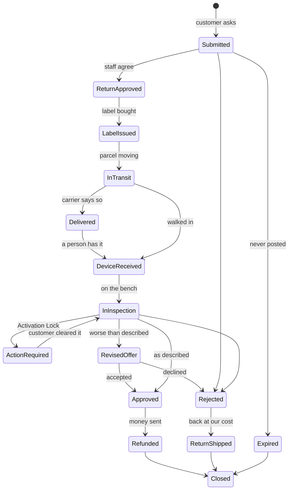
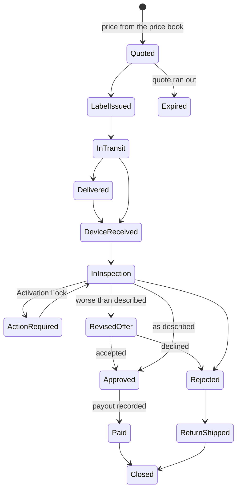

# UpCell — Backend

The API behind upcellit.com: catalogue, orders, payments, returns and trade-ins.

**Read this first, then [`../PIPELINE.md`](../PIPELINE.md).** This file says how
the system works; PIPELINE.md says what is not finished and what is blocked on a
person. [`../HANDOVER.md`](../HANDOVER.md) has the payment history.

---

## The shape of it

- **Express 4** on **Node 20**, **MongoDB** via **Mongoose 7** (Atlas M0 shared
  tier — expect a ~250-300ms network floor on any query, which is the tier and
  not the code)
- **Clerk** verifies session tokens and carries the admin role
- **Bank of America** Hosted Payment Page takes the card. **Not Stripe** — the
  earlier README said Stripe and that has not been true for a long time
- **Resend** sends email, **Cloudinary** stores images
- **1,633 tests across 63 suites** (`npm test`). Run them before every push

### One row, one phone

The single most important thing to know about this database: **every catalogue
row is one physical device.** There is no quantity column. A `SingleVariation`
is not "iPhone 13 128GB Midnight" — it is *that* iPhone 13, with its own IMEI,
its own battery reading and its own grade. Selling it twice is the failure the
stock-hold code exists to prevent, and most of the design follows from this.

Accessories are the exception: they are real products so the cart, tax and
receipts work on them without special cases, and they are **not** single units.

---

## Money is in cents

Every money field on this project is an integer number of cents, named
`*Cents`. Dollars survive only on older records and in a few legacy fields kept
for orders written before the migration.

The reason is on the receipt page: rounding to the cent and then letting a page
round again to the dollar rounds twice, and it made 18 of 18 paid orders quote
the wrong total. Round once, at the point of display.

---

## Environment

`src/config/env.js` refuses to start without the first eight. The rest change
behaviour when present and are safe to leave unset.

### Required

| Variable | What it is |
|---|---|
| `MONGODB_URL` | Atlas connection string. **Not** `MONGO_URI` — every script reads this name |
| `CLERK_SECRET_KEY` | Verifies session tokens. Also salts the deleted-account pseudonym |
| `RESEND_KEY` | Email |
| `PORT` | 5001 locally |
| `FRONTEND_URL` | Used to build links inside emails. A wrong value sends customers to the wrong site |
| `FRONTEND_ORIGINS` | Comma-separated CORS allowlist |
| `ADMIN_NOTIFICATION_EMAIL` | Where staff alerts go |
| `EMAIL_FROM` | The From address on every send |

### Payments

| Variable | What it is |
|---|---|
| `BOA_PROFILE_ID` | Bank of America Secure Acceptance profile |
| `BOA_ACCESS_KEY` | Profile access key |
| `BOA_SECRET_KEY` | Signs the request. **Never** reaches the browser |
| `BOA_ENDPOINT` | Test or production Secure Acceptance URL |

### Optional

| Variable | Default | What it changes |
|---|---|---|
| `SALES_TAX_RATE` | `0.08` | The rate quoted and charged. Read per call, not at import, so it can change without a restart |
| `IDENTITY_REQUIRED` | off | Exactly `"true"` demands an IMEI on a phone and a serial on a tablet or laptop before checkout. **Leave off** until the physical audit in PIPELINE.md is done — 954 of 956 devices have neither, so turning it on refuses most of the shop |
| `CLOUDINARY_CLOUD_NAME` / `CLOUDINARY_API_KEY` / `CLOUDINARY_API_SECRET` | — | Image upload and the return-photo purge. Without them the purge has nothing to delete with |
| `FRONTEND_ORIGIN_PATTERNS` | — | Regex origins, for Vercel preview URLs |
| `GOOGLE_CHAT_WEBHOOK_URL` | — | Staff alerts to a chat room as well as email |
| `SITE_URL` / `DEV_URL` / `PROD_URL` | — | Read by scripts, not by the server |

Two more, `OLD_MONGODB_URL` and `NEW_MONGODB_URL`, are read only by the
one-off database-copy script.

---

## Layout

```
index.js              Express setup, middleware order, route mounting
database.js           Mongo connection
src/
  config/env.js       Refuses to start without the required variables
  routes/             19 files, ~110 routes. All mounted at / by routes/index.js
  controllers/        Request handling. Thin where it can be
  services/           The rules. Pure where possible, so they test without a database
  models/             Mongoose schemas
  constants/          Enumerations and state machines
  middleware/         auth, validation, rate limits, error handling
  utils/              Small shared helpers
  schemas/            Zod request validation
tests/                63 suites. Jest, no database
scripts/              26 one-off and maintenance scripts — see scripts/README.md
docs/                 data-retention.md, grading-sop.md
```

### Where the rules live

Controllers should not decide anything important. The rules are in `services/`
so they can be tested against handmade data with no database and no mail
server, which matters most for the jobs that run unattended at three in the
morning.

| Service | Decides |
|---|---|
| `returnWindow.js` | When the customer's 30 days start, and from which of three sources |
| `refundEligibility.js` | Whether an order can be returned, and whether it is a return or a warranty claim |
| `warranty.js` | The 12 months after the 30 days. Hardware faults only; repair or replace, refund as an exception |
| `refund.js` | What a refund comes to |
| `returnInspection.js` | Whether an inspection is complete, and what it points to |
| `grading.js` | The two axes a grade is the lower of. **A battery drop is never damage** |
| `revisedOffer.js` | An offer worth less than the full amount, and what justifies it |
| `returnShipping.js` | Both parcel legs. Shared with trade-ins |
| `returnJobs.js` | Six daily jobs, every dependency injected |
| `tradeInPricing.js` | What UpCell pays for a device. **Never** trusts a posted estimate |
| `productImport.js` | Reading a spreadsheet of stock, row by row |
| `payoutSafety.js` | Keeping account numbers out of the database |
| `orderView.js` | Who is allowed to see an order. An allowlist, not a denylist |

---

## Returns



Two edges are deliberately missing and both are load-bearing:

- **`LabelIssued` cannot go to `DeviceReceived`.** A label printed is not a
  parcel moving. Allowing it is how a return gets marked complete for a box on
  a customer's kitchen table.
- **`Delivered` is not `DeviceReceived`.** The carrier saying "delivered" is a
  claim about a doorstep; a person confirming receipt is a claim about a device
  in a hand. Inspection follows the second.

Past day 30 a request is a **warranty claim** rather than a return: hardware
faults only, and it ends in a repair or a replacement. Only
`REFUND_EXCEPTION` pays out, and it writes `warrantyException: true` onto the
order so an accountant reading a refund eleven months after the sale can see
why there is one.

The map is `src/constants/returnStatus.js`. Nothing changes a status except
`services/returnTimeline.js` — a controller reaching for `findByIdAndUpdate`
on `status` skips the map, and an illegal state reached once stays reached.

---

## Trade-ins

The same journey with the device travelling the other way, and it calls the
same shipping, inspection and offer services on purpose.



There is nothing before `Quoted`: a return starts from an order UpCell already
has, a trade-in starts from a price UpCell offered.

Three things differ in meaning rather than in shape:

- **`imei_matches` records the number** instead of matching it. There is no
  prior record of the device, so the inspection *is* the record.
- **`matches_grade_sold` is skipped.** There is no grade UpCell sold it at.
- **UpCell pays both postage legs.** There is no version of a trade-in where
  the customer pays to send it in.

An agreed trade-in can become a catalogue row — out of stock, with no price,
and `acquisitionSource: "INDIVIDUAL"`, which is what closes the
return-to-supplier route on that unit forever.

**Payouts store no account numbers.** Every free-text field rejects nine or
more consecutive digits, and what is kept is the method, the name, and a masked
reference. See `services/payoutSafety.js`.

---

## Routes

All mounted at `/` by `src/routes/index.js`.

| File | Routes | Covers |
|---|---|---|
| `product.routes.js` | 15 | Catalogue, shop listing, bulk import, stock summary |
| `category.routes.js` | 10 | Categories and product families |
| `order.routes.js` | 13 | Checkout, orders, guest order links, account deletion |
| `refundRequest.routes.js` | 23 | Returns end to end, plus the report |
| `tradeIn.routes.js` | 22 | Trade-ins end to end, price book, questions, report |
| `review.routes.js` | 5 | Reviews and moderation |
| `bankOfAmerica.routes.js` | 4 | Hosted Payment Page signing and the response |
| `reconciliation.routes.js` | 4 | Matching the gateway against the orders |
| `cart.routes.js` | 3 | Cart lookup, and a signed-in customer's saved cart |
| `analytics.routes.js` | 3 | Event capture and the admin view |
| `notification.routes.js` | 3 | Staff notifications |
| `contact.routes.js` | 4 | Contact form |
| `newsletter.routes.js` | 4 | Subscriptions |
| `wholesale.routes.js` | 3 | Wholesale enquiries |
| `emailConfig.routes.js` | 2 | Email on/off switches |
| `monthlySell.routes.js` | 2 | The month's sales figure |
| `auditLog.routes.js` | 1 | Append-only staff action log |
| `upload.routes.js` | 1 | Cloudinary signature |

Everything under `/admin-*` is behind `verifyToken` **and** `requireAdmin`.
Customer routes are behind `verifyToken`. Three paths are open by token
instead, because they arrive by email and have to work for somebody who has not
signed in for months: a guest's order, a revised refund offer, and a revised
trade-in offer. Those tokens are 256 random bits, stored only as a SHA-256
hash, and compared in constant time.

---

## Scripts

26 of them, all dry-run by default and applying only with `--write`. See
[`scripts/README.md`](scripts/README.md) for the full list. The ones likely to
be needed next:

| Script | What it does |
|---|---|
| `migrate-trade-in-status.js` | Moves the six old trade-in statuses onto the state machine. **Not yet run against production** |
| `backfill-device-identity.js` | Fills `deviceType`, `carrierStatus` and `refurbState`. Does not invent IMEIs |
| `seed-trade-in-pricebook.js` | Seeds the price book and the condition questions |
| `migrate-order-items.js` | Older orders onto the `items`/`*Cents` shape |

---

## Running it

```bash
npm install
npm run dev      # nodemon on PORT
npm test         # 63 suites, no database needed
```

`npm test` needs no database and no network. If a suite wants either,
something has been wired wrong — every service takes its dependencies as
arguments so it can be tested without them.

### Before pushing

```bash
npm test
```

Check the exit code, not the output. A piped command returns the exit code of
the **last** command in the pipe, so `npx jest | tail -4 && git commit` commits
over a red suite — `tail` always succeeds. Use:

```bash
npx jest >/dev/null 2>&1; echo "exit: $?"
```

---

## Things that have bitten us

Worth reading once. Each of these was a real bug.

- **`Number("")` is `0`, not `NaN`.** A blank battery reading became a dead
  battery; a blank tax rate became free tax. Check the string first.
- **`select: false` is not storage protection.** It hides a field from a query
  that does not ask for it. Access tokens are hashed for this reason.
- **A denylist of fields to strip leaks the next field somebody adds.** Every
  response that leaves the building is an allowlist.
- **Zod's `validateRequest` replaces `req.body` wholesale.** A field the schema
  does not name never reaches the service. This silently broke every revised
  refund offer until it was found while building the trade-in equivalent.
- **Rounding twice is wrong.** See "Money is in cents".
- **A regex built from user input is an injection.** Case-insensitive matching
  uses a Mongo collation (`{ locale: "en", strength: 2 }`), not `new RegExp`.
- **An audit row needs a real `targetId`.** A bulk action is audited per
  product family, not once with an invented id.
